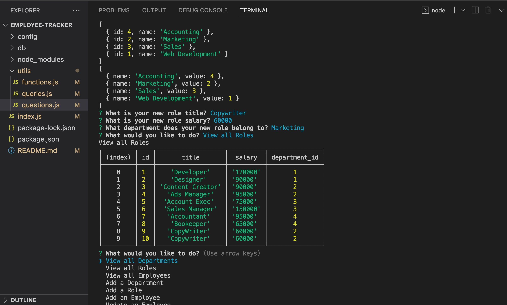

# Employee Tracker

## Description
The Employee Tracker is a Command Line Apllication that manages a company's employee database using Inquirer, MySQL and Node.js. Users are presented with a list of options to View, Update, Create or Delete Employee and Departmental information from the terminal command line and are presented with a view of the updated table using the Console.table package.

## Visuals
[Walkthrough Video](https://drive.google.com/file/d/1EaRsXVYpt8l6cWj4Tm-rQGQz9Pan1Iyx/view?usp=sharing)

## Contributing
Created by Deborah DeeAnn Stelzl
